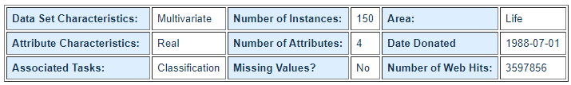

# IrisRecognitionWithML.NET

## About Dataset

### Source of Dataset

- Creator: R.A. Fisher
- Donor: Michael Marshall (MARSHALL%PLU '@' io.arc.nasa.gov)

### Data Set Information

This is perhaps the best known database to be found in the pattern recognition literature. Fisher's paper is a classic in the field and is referenced frequently to this day. (See Duda & Hart, for example.) The data set contains 3 classes of 50 instances each, where each class refers to a type of iris plant. One class is linearly separable from the other 2; the latter are NOT linearly separable from each other.

Predicted attribute: class of iris plant.

This is an exceedingly simple domain.

This data differs from the data presented in Fishers article (identified by Steve Chadwick, spchadwick '@' espeedaz.net). The 35th sample should be: 4.9,3.1,1.5,0.2,"Iris-setosa" where the error is in the fourth feature. The 38th sample: 4.9,3.6,1.4,0.1,"Iris-setosa" where the errors are in the second and third features.

### Attribute Information

1. sepal length in cm
2. sepal width in cm
3. petal length in cm
4. petal width in cm
5. class:
-- Iris Setosa
-- Iris Versicolour
-- Iris Virginica

You can download this dataset at [https://archive.ics.uci.edu/ml/machine-learning-databases/iris/](https://archive.ics.uci.edu/ml/machine-learning-databases/iris/)

## About this project

| ML.NET version | API type| Status| App Type| Data type | Scenario| ML Task | Algorithms|
| --- |---| --- |---| --- |---| --- |---|
| v1.5.0 | Dynamic API | Up-to-date | Console app | .csv file | Iris flowers classification | Multi-class classification | Many |

## Result

|# | Trainer|MicroAccuracy | MacroAccuracy | Duration | #Iteration |
| --- | --- | --- | --- | --- | --- |
|1| AveragedPerceptronOva| 0.9433 |0.9514 |2.6 |1 |
|2| SdcaMaximumEntropyMulti| 0.9719 |0.9773 |5.0 |2 |
|3| LightGbmMulti| 0.9616 |0.9688 |2.0 |3 |
|4| SymbolicSgdLogisticRegressionOva | 0.5934 |0.5600 |1.3 |4 |
|5| FastTreeOva| 0.9458 |0.9537 |3.5 |5 |
|6| LinearSvmOva | 0.9545 |0.9611 |1.0 |6 |
|7| LbfgsLogisticRegressionOva | 0.8928 |0.9167 |1.2 |7 |
|8| SgdCalibratedOva | 0.7102 |0.7372 |1.5 |8 |
|9| FastForestOva| 0.9458 |0.9544 |3.0 |9 |
|10 | LbfgsMaximumEntropyMulti | 0.9554 |0.9637 |0.9 | 10 |
|11 | SdcaMaximumEntropyMulti| 0.6686 |0.6667 |0.8 | 11 |
|12 | LightGbmMulti| 0.9501 |0.9574 |2.2 | 12 |
|13 | LbfgsMaximumEntropyMulti | 0.9399 |0.9489 |0.8 | 13 |
|14 | SdcaMaximumEntropyMulti| 0.9600 |0.9614 |0.8 | 14 |
|15 | LightGbmMulti| 0.9529 |0.9627 |1.4 | 15 |
|16 | LbfgsMaximumEntropyMulti | 0.9486 |0.9556 |0.7 | 16 |
|17 | SdcaMaximumEntropyMulti| 0.9176 |0.9285 |0.7 | 17 |
|18 | LightGbmMulti| 0.9529 |0.9627 |1.1 | 18 |
|19 | LbfgsMaximumEntropyMulti | 0.9501 |0.9574 |0.8 | 19 |
|20 | SdcaMaximumEntropyMulti| 0.8690 |0.8890 |1.1 | 20 |
|21 | LightGbmMulti| 0.9684 |0.9769 |3.0 | 21 |
|22 | LbfgsMaximumEntropyMulti | 0.9588 |0.9642 |0.8 | 22 |

### Experiment Results

| Summary|
| --- |
|ML Task: multiclass-classification|
|Dataset: D:\Github\IrisRecognitionWithML.NET\iris.csv |
|Label : variety |
|Total experiment time : 35.99731 Secs |
|Total number of models explored: 22 |

### Top 5 models explored

|# | Trainer|MicroAccuracy | MacroAccuracy | Duration | #Iteration |
| --- | --- | --- | --- | --- | --- |
|1SdcaMaximumEntropyMulti 0.9719 0.9773 5.01 |
|2LightGbmMulti 0.9684 0.9769 3.02 |
|3LightGbmMulti 0.9616 0.9688 2.03 |
|4SdcaMaximumEntropyMulti 0.9600 0.9614 0.84 |
|5LbfgsMaximumEntropyMulti0.9588 0.9642 0.85 |
